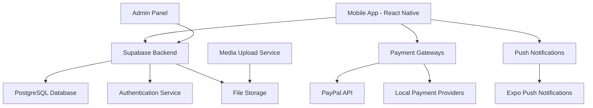

# Design Document - KasapApp

## Overview

KasapApp is a React Native mobile application that provides a comprehensive platform for religious sacrificial services. The app connects users with butcher services, handles appointment scheduling, payment processing, and provides visual proof of completed services. The architecture supports multiple delivery options including personal delivery, charity donations, restaurant services, and international distribution to Africa.

The application follows a modular architecture with clear separation of concerns, utilizing Supabase as the backend-as-a-service platform for authentication, database, and file storage.

## Architecture

### High-Level Architecture



### Technology Stack

- **Frontend**: React Native with TypeScript
- **State Management**: Zustand for global state
- **Styling**: NativeWind (Tailwind CSS for React Native)
- **Navigation**: React Navigation v6
- **Backend**: Supabase (PostgreSQL, Auth, Storage, Real-time)
- **Payment**: PayPal SDK, Stripe (future), local payment integrations
- **Notifications**: Expo Push Notifications
- **Media**: Supabase Storage with image/video optimization
- **PDF Generation**: react-native-pdf-lib for receipts
- **Internationalization**: react-i18next

## Components and Interfaces

### Core Components

#### 1. Authentication Module
```typescript
interface AuthService {
  signUp(email: string, password: string): Promise<AuthResponse>
  signIn(email: string, password: string): Promise<AuthResponse>
  signOut(): Promise<void>
  getCurrentUser(): User | null
  resetPassword(email: string): Promise<void>
}

interface User {
  id: string
  email: string
  profile: UserProfile
  createdAt: Date
}

interface UserProfile {
  firstName: string
  lastName: string
  phone?: string
  language: 'tr' | 'en' | 'ar'
  notificationPreferences: NotificationSettings
}
```

#### 2. Order Management Module
```typescript
interface OrderService {
  createOrder(orderData: CreateOrderRequest): Promise<Order>
  getOrders(userId: string): Promise<Order[]>
  getOrderById(orderId: string): Promise<Order>
  updateOrderStatus(orderId: string, status: OrderStatus): Promise<void>
}

interface Order {
  id: string
  userId: string
  serviceType: 'kurban' | 'adak' | 'sukur'
  deliveryType: 'personal' | 'charity' | 'restaurant' | 'africa'
  appointmentDate: Date
  status: OrderStatus
  totalAmount: number
  currency: string
  specialNotes?: string
  charityOrganization?: string
  createdAt: Date
  updatedAt: Date
}

type OrderStatus = 'pending' | 'scheduled' | 'in_progress' | 'completed' | 'delivered' | 'donated'
```

#### 3. Calendar & Appointment Module
```typescript
interface CalendarService {
  getAvailableSlots(date: Date): Promise<TimeSlot[]>
  bookAppointment(orderId: string, slot: TimeSlot): Promise<Appointment>
  cancelAppointment(appointmentId: string): Promise<void>
}

interface TimeSlot {
  id: string
  date: Date
  startTime: string
  endTime: string
  isAvailable: boolean
  capacity: number
  bookedCount: number
}

interface Appointment {
  id: string
  orderId: string
  timeSlot: TimeSlot
  status: 'scheduled' | 'completed' | 'cancelled'
}
```

#### 4. Payment Module
```typescript
interface PaymentService {
  processPayment(paymentData: PaymentRequest): Promise<PaymentResult>
  getPaymentMethods(): Promise<PaymentMethod[]>
  generateReceipt(orderId: string): Promise<string> // PDF URL
}

interface PaymentRequest {
  orderId: string
  amount: number
  currency: string
  method: PaymentMethod
  metadata?: Record<string, any>
}

interface PaymentMethod {
  id: string
  type: 'paypal' | 'iban' | 'local'
  name: string
  isEnabled: boolean
  configuration: Record<string, any>
}
```

#### 5. Media Management Module
```typescript
interface MediaService {
  uploadMedia(file: File, orderId: string): Promise<MediaFile>
  getOrderMedia(orderId: string): Promise<MediaFile[]>
  optimizeMedia(file: File): Promise<File>
}

interface MediaFile {
  id: string
  orderId: string
  type: 'image' | 'video'
  url: string
  thumbnailUrl?: string
  size: number
  uploadedAt: Date
}
```

#### 6. Review System Module
```typescript
interface ReviewService {
  submitReview(reviewData: CreateReviewRequest): Promise<Review>
  getReviews(filters?: ReviewFilters): Promise<Review[]>
  moderateReview(reviewId: string, action: 'approve' | 'reject'): Promise<void>
}

interface Review {
  id: string
  orderId: string
  userId: string
  content: string
  rating: number
  isAnonymous: boolean
  authorName?: string
  status: 'pending' | 'approved' | 'rejected'
  createdAt: Date
}
```

### Screen Components

#### Navigation Structure
```typescript
type RootStackParamList = {
  Welcome: undefined
  Auth: undefined
  Main: undefined
}

type MainTabParamList = {
  Home: undefined
  Orders: undefined
  Calendar: undefined
  Media: undefined
  Profile: undefined
}

type HomeStackParamList = {
  HomeScreen: undefined
  OrderDetails: { orderId?: string }
  Payment: { orderId: string }
  OrderConfirmation: { orderId: string }
}
```

## Data Models

### Database Schema

#### Users Table
```sql
CREATE TABLE users (
  id UUID PRIMARY KEY DEFAULT gen_random_uuid(),
  email VARCHAR UNIQUE NOT NULL,
  created_at TIMESTAMP DEFAULT NOW(),
  updated_at TIMESTAMP DEFAULT NOW()
);

CREATE TABLE user_profiles (
  id UUID PRIMARY KEY REFERENCES users(id),
  first_name VARCHAR NOT NULL,
  last_name VARCHAR NOT NULL,
  phone VARCHAR,
  language VARCHAR DEFAULT 'tr',
  notification_preferences JSONB DEFAULT '{}',
  created_at TIMESTAMP DEFAULT NOW(),
  updated_at TIMESTAMP DEFAULT NOW()
);
```

#### Orders Table
```sql
CREATE TABLE orders (
  id UUID PRIMARY KEY DEFAULT gen_random_uuid(),
  user_id UUID REFERENCES users(id) NOT NULL,
  service_type VARCHAR NOT NULL CHECK (service_type IN ('kurban', 'adak', 'sukur')),
  delivery_type VARCHAR NOT NULL CHECK (delivery_type IN ('personal', 'charity', 'restaurant', 'africa')),
  status VARCHAR DEFAULT 'pending' CHECK (status IN ('pending', 'scheduled', 'in_progress', 'completed', 'delivered', 'donated')),
  total_amount DECIMAL(10,2) NOT NULL,
  currency VARCHAR DEFAULT 'EUR',
  special_notes TEXT,
  charity_organization VARCHAR,
  appointment_date TIMESTAMP,
  created_at TIMESTAMP DEFAULT NOW(),
  updated_at TIMESTAMP DEFAULT NOW()
);
```

#### Media Files Table
```sql
CREATE TABLE media_files (
  id UUID PRIMARY KEY DEFAULT gen_random_uuid(),
  order_id UUID REFERENCES orders(id) NOT NULL,
  file_type VARCHAR NOT NULL CHECK (file_type IN ('image', 'video')),
  file_url VARCHAR NOT NULL,
  thumbnail_url VARCHAR,
  file_size INTEGER,
  uploaded_at TIMESTAMP DEFAULT NOW()
);
```

#### Reviews Table
```sql
CREATE TABLE reviews (
  id UUID PRIMARY KEY DEFAULT gen_random_uuid(),
  order_id UUID REFERENCES orders(id) NOT NULL,
  user_id UUID REFERENCES users(id) NOT NULL,
  content TEXT NOT NULL,
  rating INTEGER CHECK (rating >= 1 AND rating <= 5),
  is_anonymous BOOLEAN DEFAULT false,
  author_name VARCHAR,
  status VARCHAR DEFAULT 'pending' CHECK (status IN ('pending', 'approved', 'rejected')),
  created_at TIMESTAMP DEFAULT NOW(),
  moderated_at TIMESTAMP
);
```

#### Appointments Table
```sql
CREATE TABLE appointments (
  id UUID PRIMARY KEY DEFAULT gen_random_uuid(),
  order_id UUID REFERENCES orders(id) NOT NULL,
  appointment_date DATE NOT NULL,
  start_time TIME NOT NULL,
  end_time TIME NOT NULL,
  status VARCHAR DEFAULT 'scheduled' CHECK (status IN ('scheduled', 'completed', 'cancelled')),
  created_at TIMESTAMP DEFAULT NOW()
);
```

#### Time Slots Table
```sql
CREATE TABLE time_slots (
  id UUID PRIMARY KEY DEFAULT gen_random_uuid(),
  date DATE NOT NULL,
  start_time TIME NOT NULL,
  end_time TIME NOT NULL,
  capacity INTEGER DEFAULT 5,
  is_available BOOLEAN DEFAULT true,
  created_at TIMESTAMP DEFAULT NOW()
);
```

## Error Handling

### Error Types and Handling Strategy

#### 1. Network Errors
```typescript
class NetworkError extends Error {
  constructor(message: string, public statusCode?: number) {
    super(message)
    this.name = 'NetworkError'
  }
}

// Retry mechanism for network requests
const retryRequest = async (fn: () => Promise<any>, maxRetries = 3) => {
  for (let i = 0; i < maxRetries; i++) {
    try {
      return await fn()
    } catch (error) {
      if (i === maxRetries - 1) throw error
      await new Promise(resolve => setTimeout(resolve, 1000 * Math.pow(2, i)))
    }
  }
}
```

#### 2. Validation Errors
```typescript
interface ValidationError {
  field: string
  message: string
  code: string
}

const validateOrder = (orderData: CreateOrderRequest): ValidationError[] => {
  const errors: ValidationError[] = []
  
  if (!orderData.serviceType) {
    errors.push({ field: 'serviceType', message: 'Service type is required', code: 'REQUIRED' })
  }
  
  if (!orderData.deliveryType) {
    errors.push({ field: 'deliveryType', message: 'Delivery type is required', code: 'REQUIRED' })
  }
  
  return errors
}
```

#### 3. Payment Errors
```typescript
class PaymentError extends Error {
  constructor(
    message: string,
    public code: string,
    public isRetryable: boolean = false
  ) {
    super(message)
    this.name = 'PaymentError'
  }
}

// Payment error handling
const handlePaymentError = (error: PaymentError) => {
  switch (error.code) {
    case 'INSUFFICIENT_FUNDS':
      return 'Insufficient funds. Please check your payment method.'
    case 'CARD_DECLINED':
      return 'Payment declined. Please try a different payment method.'
    case 'NETWORK_ERROR':
      return 'Network error. Please try again.'
    default:
      return 'Payment failed. Please contact support.'
  }
}
```

#### 4. Media Upload Errors
```typescript
const handleMediaUpload = async (file: File, orderId: string) => {
  try {
    // Validate file size (max 50MB)
    if (file.size > 50 * 1024 * 1024) {
      throw new Error('File size too large. Maximum 50MB allowed.')
    }
    
    // Validate file type
    const allowedTypes = ['image/jpeg', 'image/png', 'video/mp4', 'video/mov']
    if (!allowedTypes.includes(file.type)) {
      throw new Error('Invalid file type. Only JPEG, PNG, MP4, and MOV files are allowed.')
    }
    
    return await mediaService.uploadMedia(file, orderId)
  } catch (error) {
    console.error('Media upload failed:', error)
    throw error
  }
}
```

## Testing Strategy

### 1. Unit Testing
- **Framework**: Jest + React Native Testing Library
- **Coverage**: All service functions, utility functions, and custom hooks
- **Mock Strategy**: Mock Supabase client, payment APIs, and external services

```typescript
// Example unit test
describe('OrderService', () => {
  it('should create order with valid data', async () => {
    const mockOrderData = {
      serviceType: 'kurban',
      deliveryType: 'charity',
      totalAmount: 150,
      currency: 'EUR'
    }
    
    const result = await orderService.createOrder(mockOrderData)
    
    expect(result).toHaveProperty('id')
    expect(result.status).toBe('pending')
  })
})
```

### 2. Integration Testing
- **Database Operations**: Test CRUD operations with test database
- **API Integration**: Test Supabase integration with test environment
- **Payment Flow**: Test payment processing with sandbox environments

### 3. End-to-End Testing
- **Framework**: Detox for React Native
- **Scenarios**: Complete user flows from registration to order completion
- **Test Data**: Automated test data setup and cleanup

```typescript
// Example E2E test
describe('Order Flow', () => {
  it('should complete full order process', async () => {
    await element(by.id('service-type-kurban')).tap()
    await element(by.id('delivery-type-charity')).tap()
    await element(by.id('select-date-button')).tap()
    await element(by.id('confirm-order-button')).tap()
    
    await expect(element(by.id('order-confirmation'))).toBeVisible()
  })
})
```

### 4. Performance Testing
- **Load Testing**: Test app performance with large datasets
- **Memory Usage**: Monitor memory leaks and optimize
- **Network Performance**: Test with slow network conditions

### 5. Security Testing
- **Authentication**: Test JWT token handling and expiration
- **Data Validation**: Test input sanitization and validation
- **File Upload**: Test malicious file upload prevention
- **API Security**: Test unauthorized access prevention

## Implementation Considerations

### 1. Offline Support
- Cache critical data using AsyncStorage
- Queue actions when offline and sync when online
- Show appropriate offline indicators

### 2. Performance Optimization
- Implement lazy loading for screens and components
- Use FlatList for large data sets
- Optimize images and videos for mobile
- Implement proper caching strategies

### 3. Accessibility
- Implement proper accessibility labels
- Support screen readers
- Ensure proper color contrast
- Test with accessibility tools

### 4. Internationalization
- Use react-i18next for translations
- Support RTL languages (Arabic)
- Format dates, numbers, and currencies based on locale
- Implement proper text scaling

### 5. Security Best Practices
- Implement proper authentication flows
- Use secure storage for sensitive data
- Validate all user inputs
- Implement proper error handling without exposing sensitive information
- Use HTTPS for all API communications